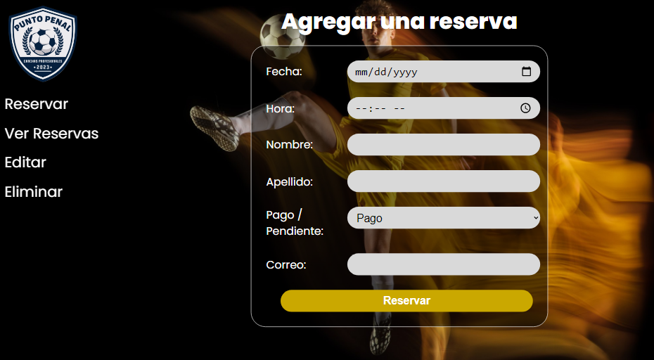
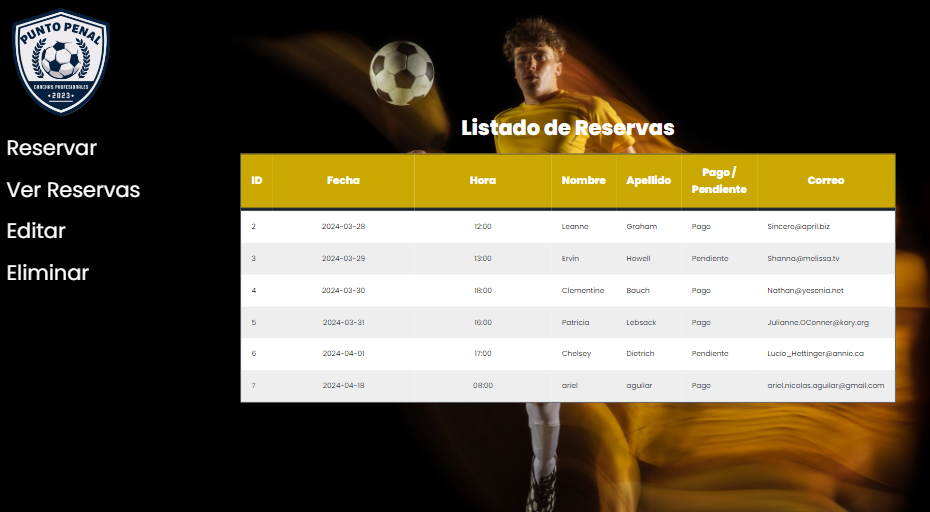

# CRUD Punto Penal

[Link al sitio web](https://arielnicolas2021.github.io/crud-reservas/)

## Descripción

Crear, leer, modificar y eliminar reservas de una cancha de fútbol.

## Tecnologías utilizadas

- HTML
- CSS
- Javascript
- Vue.js
- SQL
- Python
- Flask